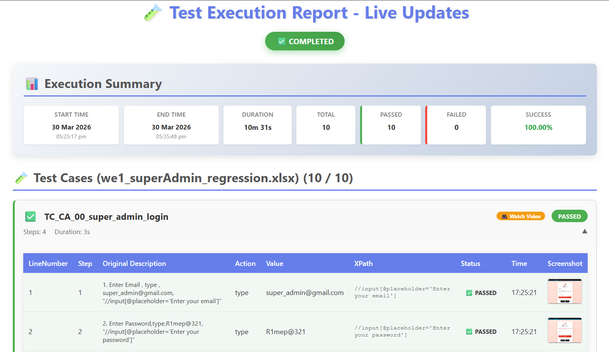

<div align="center">

# ⚙️ ABCD AUTOMATION FRAMEWORK
### *Keyword-Driven Selenium Testing Engine*

[](https://www.oracle.com/java/)
[](https://www.selenium.dev/)
[](https://maven.apache.org/)

**A Reusable and Scalable Framework for Simplified Web Automation**
</div>

---

## 📖 Overview
The **ABCD Framework** is designed to bridge the gap between manual testers and automation. By utilizing a **Keyword-Driven approach**, it allows test cases to be written in plain language (keywords) within external files, which the engine then translates into automated actions using Selenium WebDriver.

---

## 🏗️ Architecture & Logic
The framework is built on a modular "Plug-and-Play" design:

* **Action Keywords:** A library of reusable functions (e.g., `click`, `type`, `verify`) that handle browser interactions.
* **Execution Engine:** The core logic that reads the test steps and invokes the corresponding action keywords.
* **Data Controller:** Manages the input from Excel/Property files using Apache POI.
* **Locator Repository:** Centralized storage for element locators (XPath, CSS) to ensure easy maintenance.


---

## 📸 Test Reporting Preview
The framework generates rich, interactive HTML reports. Each test step includes automatic failure screenshots for rapid debugging.



---

## ✨ Key Features
* **🚀 High Reusability:** Write a keyword once and use it across hundreds of test cases.
* **📊 External Configuration:** Manage test execution flows via Excel or Properties files without changing code.
* **🔍 Robust Logging:** Detailed console logs for every action performed during execution.
* **🛠️ Error Handling:** Built-in try-catch blocks and explicit waits to handle synchronization issues.

---

## 💻 Tech Stack
| Component | Technology |
| :--- | :--- |
| **Language** | Java 17 |
| **Automation Engine** | Selenium WebDriver |
| **Data Management** | Apache POI / Properties |
| **Build Tool** | Maven |

---

## 🚦 Getting Started

### Prerequisites
* JDK 17+
* Maven 3.x
* Compatible WebDrivers (ChromeDriver/GeckoDriver)

### Installation
1.  **Clone the Repo:**
    ```bash
    git clone [https://github.com/faizal08/ABCD_Framework.git](https://github.com/faizal08/ABCD_Framework.git)
    ```
2.  **Install Dependencies:**
    ```bash
    mvn clean install
    ```
3.  **Run Tests:**
    ```bash
    mvn test
    ```

---

## 📧 Contact
- **Developer:** [Faizal](https://github.com/faizal08)
- **Email:** [reachfaizal08@gmail.com](mailto:reachfaizal08@gmail.com)
